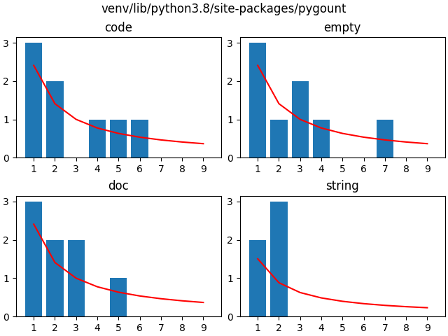
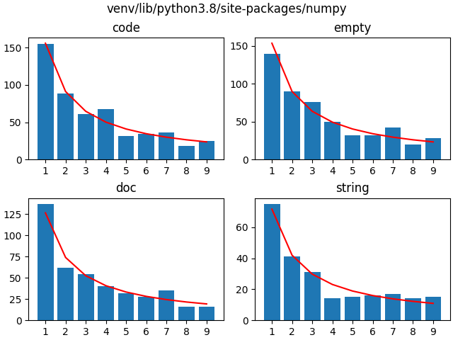
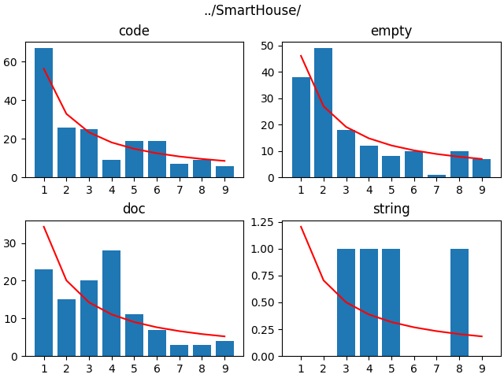
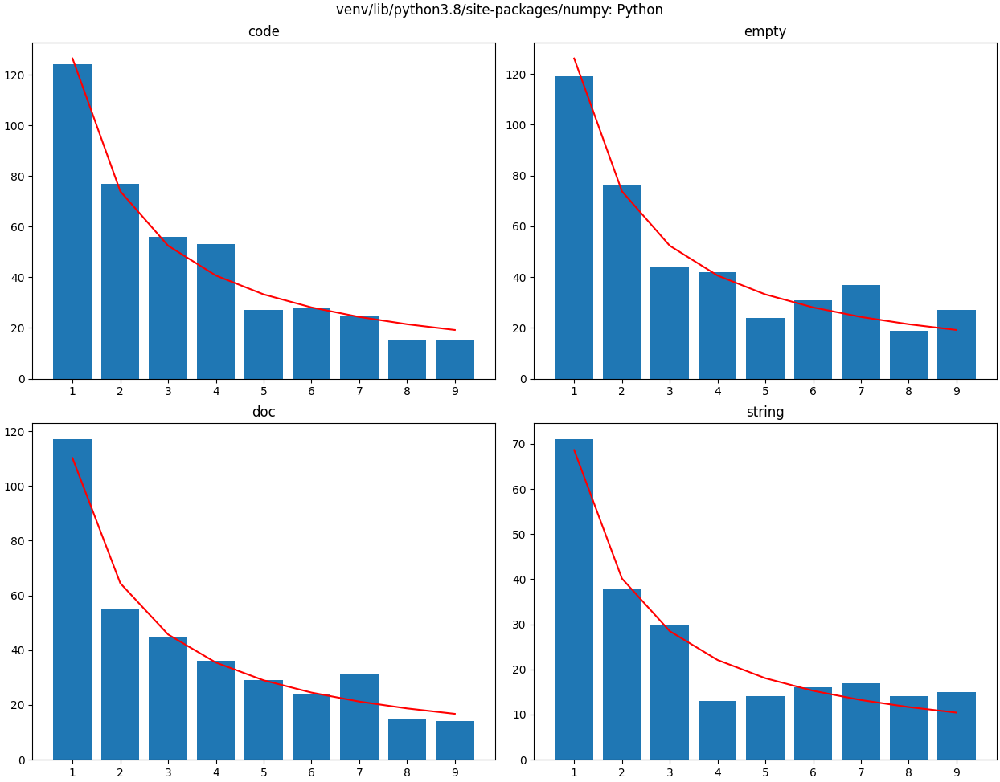
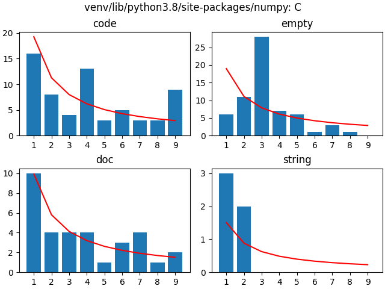
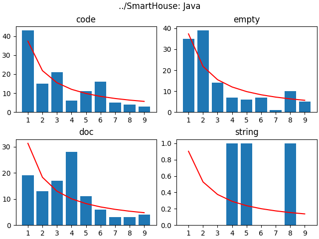
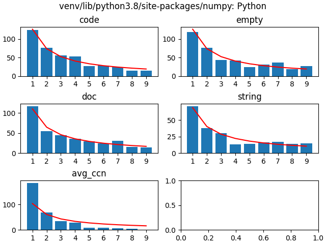
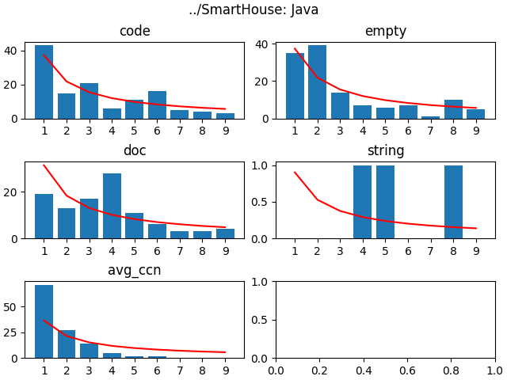
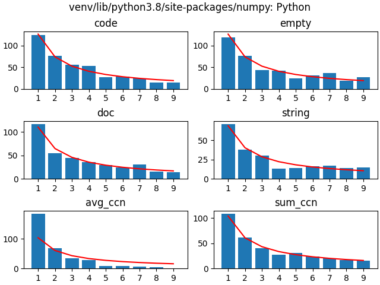
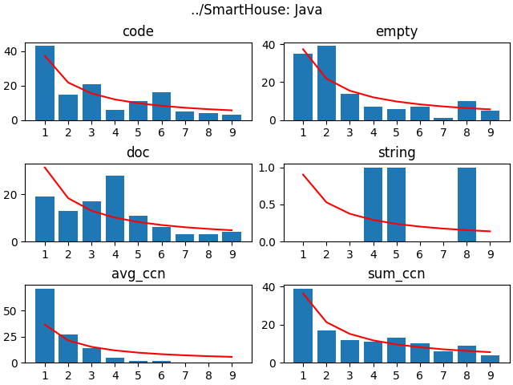

# Benford

After hearing a documentary about how [Benford's law](https://en.wikipedia.org/wiki/Benford%27s_law) was used to discover anomalies in tax declaration, I wanted to know if I can use it for code quality.

First hypothesis:
```
LOC should follow Benford's law. If not, there is something fishy.
```

With the first version of the script, we can already see that the different metrics seem to follow Benford's law.

The metrics are from [pygount](https://pygount.readthedocs.io/en/latest/api.html):
* code: line of code
* empty: line with only whitespaces/newline
* doc: documentation
* string: lines containing only strings for the language)

### Pygount



The code and the documentation seem to fit. Probably the fact that there are few lines/files will make outliers appear more.

### Numpy



It looks very good, especially with numpy. The bigger the project, the more it matches.


At this point I felt that the scipt was slow (at scanning the files mostly), so I'll try to optimize it.

By looking a the profile for numpy's case (cProfile + SnakeViz), I can see that the actual analysis takes time. So using a multithread pool should make thing faster easily (I'm not into heavy opitimization either). With a pool of 10 workers/threads/whatever it went from ~16s to ~5s, let's say it is enough for now.

## SmartHouse

SmartHouse is a student group projet of mine, so I expect it to be far worse than Numpy :p



The code part does not seems so off from Benford's Law, but documentation seems out (string too, but there are only 4 occurences).

The second column of the `empty` section might be explained by:
* the lack of formatting tool/discipline
* the specificity of languages (maybe we had a formatting tool after all, which force the newlines to 2 for some languages ?)
* the mixing of different languages (mostly bash scripts and java code)

## Unmixing languages

Now I will try to filter the results according to the language the file was written. pygount provides me with the information, so that was very easy.

### Numpy v2



Again, looks very good !



It is not as neat as with python but there are less files, and it is probably filled with very optimized code (should optimized code follows Benford's Law ?).

### SmartHouse v2



The discrepancies in documentation might be even more obvious :p

## Adding cyclomatic complexity

Next Step might be to focus on programming language, and launch the tool on different repos (with `good` or `bad` reputation). Or try to count UTs/complexity.

I will try cyclomatic complexity first, because it seems easier to measure it for different languages. I used [lizard](https://github.com/terryyin/lizard) for this. This library seems to be a bit "left over" on pypi, but the repo shows signs of activity. It gives us several metrics, and among them average cyclomatic complexity.

### Numpy v3



Interestingly, the average code complexity seems to follows a logarithmic curve, but steeper than Benford's. The 1s stand out more than the rest (let's hope the complexity is near 1, not 10 or 100 ;) )

The same scan on the C files shows the same pattern.

### SmartHouse v3



Even though there were differences with Numpy in the previous metrics, I feel like both project have very similar repartition for cyclomatic complexity.

## Cyclomatic complexity (sum)

Now I will just count the cyclomatic complexity of a file (so the sum of the cyclomatic complexity that one can find in).

### Numpy v4



Seems far better then average, I should have started with this one !

### SmartHouse v4



Seems to follow Benford's law more closely.

I think I will keep this one and remove the average complexity.

# Reminders

Python venv:
```bash
python3 -m venv venv
source venv/bin/activate
```